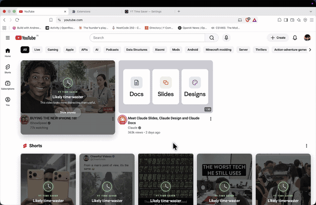

# YT Time Saver
YT Time Saver is a Chrome extension that puts a cover over videos that look more distracting than useful, powered by [Jev from TypeSafe](https://docs.typesafe.ai/introduction).

## quick install

You'll need Chrome and your own [TypeSafe API key](https://console.typesafe.ai/keys).

1. [Download the code](https://github.com/jaibhasin/jev-yt-time-saver/archive/refs/heads/main.zip) and unzip it.
2. Open `chrome://extensions` and turn on **Developer mode**.
3. Click **Load unpacked** and select the folder containing `manifest.json`.
4. Open **YT Time Saver** from Chrome's extensions menu, click **Settings**, paste your API key, and save.
5. Open or refresh YouTube.

